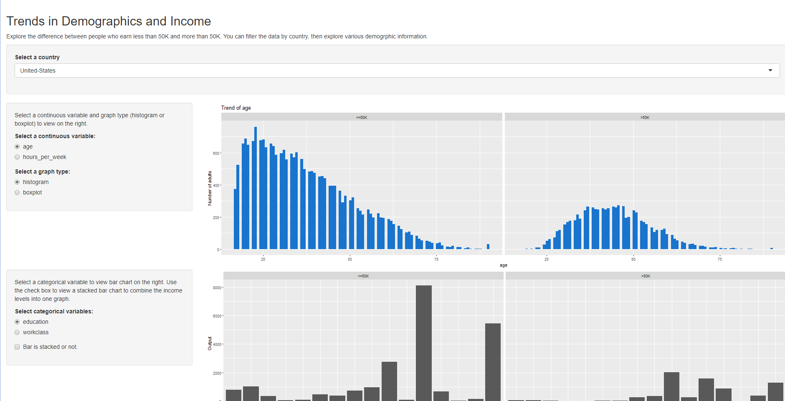

# R shiny project

In this project I worked with R-shiny on an "adult" dataset to make an interactive dashboard.

## Getting Started

You will need R-studio or R and VSC-code to run this project.

### Prerequisites
R-studio
R/VSC
R shiny framework

```
You can work and deploy this project in R-studio. Although there is many ways.
```

### Installing

Install R-studio on your computer
```
Go to File -> New -> Shiny Project
```
Download the R-shiny package
```
Install the package
```
Download all the files in the folder "Project 12"

## Running the tests

Run server.R on the enviroment and then you will see the dashboard on your local machine.



## Built With

* [R-shiny](https://shiny.rstudio.com/) - The framework used
* [R-studio](https://www.rstudio.com/) - Editor code

## Authors

* **Esteban Encina** - *All* - [eeeds](https://github.com/eeeds)
